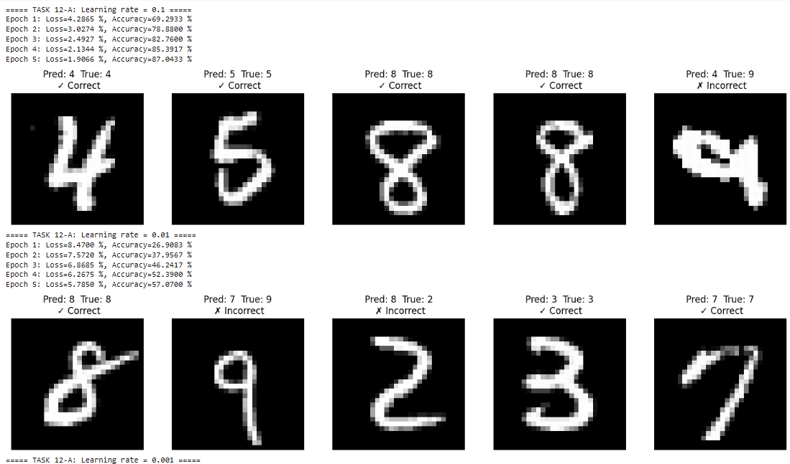
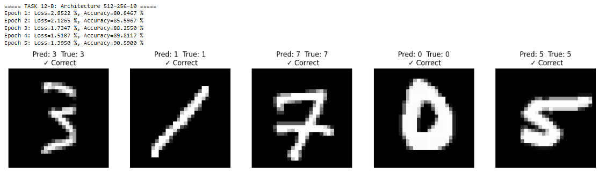
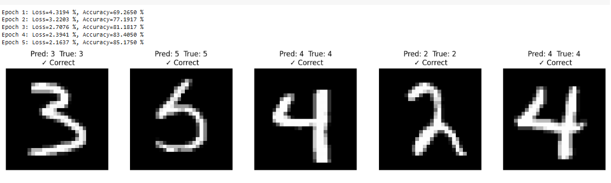
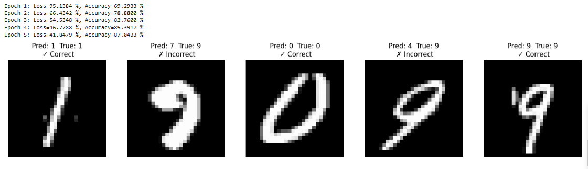
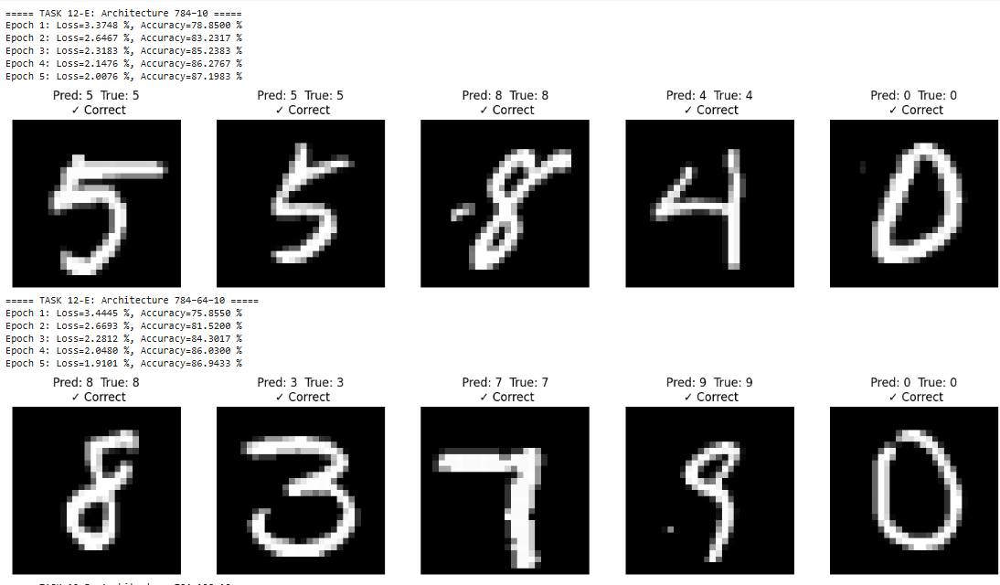
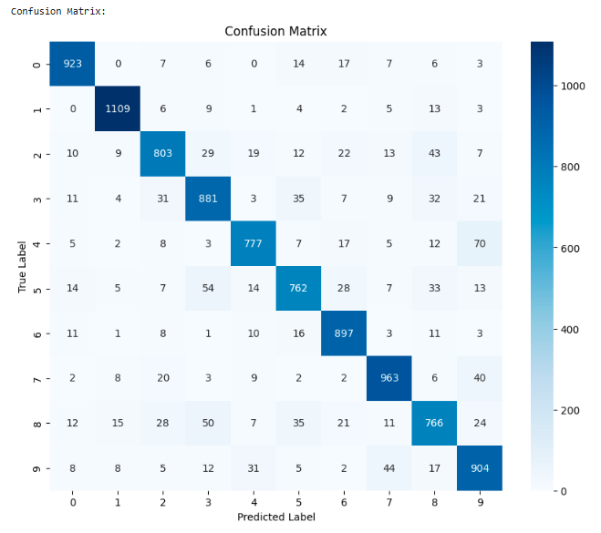

# MNIST Neural Network

This project implements a fully connected neural network from scratch to classify handwritten digits from the MNIST dataset. The implementation is written in Python and supports customizable network architectures, activation functions, loss functions, and hyperparameters. The project is designed to be modular, well-documented, and suitable for educational purposes or as a starting point for further experimentation.

---

## 🧠 Project Description

The MNIST Neural Network project aims to classify handwritten digits (0-9) using a custom-built neural network. The MNIST dataset, a benchmark in machine learning, contains 70,000 grayscale images (28x28 pixels) with corresponding labels. This project implements the neural network without relying on high-level frameworks like TensorFlow or PyTorch, providing insight into the mechanics of neural networks, including forward and backward propagation, weight initialization, and gradient descent.

---

## 🚀 Key Features

- **Data Preprocessing:** Loads, normalizes, and splits the MNIST dataset into training (60,000 samples) and test (10,000 samples) sets. Includes one-hot encoding for labels and visualization of random images.
- **Neural Network Implementation:** Supports multiple hidden layers, tanh and sigmoid activation functions for hidden layers, and softmax for the output layer. Implements Xavier weight initialization and mini-batch gradient descent.
- **Loss Functions:** Supports `cross_entropy` (with softmax) and `mean_squared_error` loss functions.
- **Training:** Configurable learning rates, batch sizes, epochs, and architectures. Logs training loss and accuracy per epoch.
- **Experiments:** Run experiments with different learning rates, architectures, activation functions, and loss functions.
- **Evaluation:** Evaluates the best model using a confusion matrix, accuracy, precision, recall, and F1-score (macro-averaged).
- **Modularity:** Modular code for easy extension and maintenance.

---

## 🎯 Objectives

- Demonstrate a complete neural network implementation from scratch.
- Explore the impact of hyperparameters and architectural choices.
- Provide a reproducible codebase for learning and experimentation.

---

## ⚙️ Requirements

- Python 3.8 or higher
- Dependencies:
  - numpy>=1.21.0
  - matplotlib>=3.4.0
  - scikit-learn>=1.0.0

---

## 🔧 Installation

### Clone the Repository:
```bash
git clone https://github.com/yourusername/mnist_neural_network.git
cd mnist_neural_network
```

### Create and Activate a Virtual Environment:
```bash
python -m venv venv
source venv/bin/activate  # On Windows: venv\Scripts\activate
```

### Install Dependencies:
```bash
pip install -r requirements.txt
```

---

## ▶️ Usage

Run the main script to execute the entire pipeline:
```bash
python src/main.py
```

### Script Workflow
- **Data Loading & Preprocessing:** MNIST dataset normalization, splitting, one-hot encoding.
- **Image Visualization:** 
- **Training & Experiments:**
  - Learning Rates: `[0.1, 0.01, 0.001]`
  - Architectures: `[[784, 256, 128, 64, 10], [784, 512, 256, 10], [784, 10], [784, 64, 10], [784, 128, 10]]`
  - Activation Functions: `[tanh, sigmoid]`
  - Loss Functions: `[cross_entropy, mse]`
- **Evaluation:** Confusion matrix and detailed metrics.

---

## 📂 Project Structure

```
mnist_neural_network/
├── assets/
│   ├── Experiments_Screenshots/
│   │   ├── experiment_01.png
│   │   ├── experiment_02.png
│   │   ├── experiment_03.png
│   │   ├── experiment_04.png
│   │   ├── experiment_05.png
│   ├── confusion_matrix.png
│   └── model_evaluation_metrics.png
├── src/
│   ├── __init__.py
│   ├── data_preprocessing.py
│   ├── neural_network.py
│   ├── train.py
│   ├── evaluate.py
│   └── main.py
├── README.md
├── requirements.txt
└── LICENSE.txt
```

---

## 📊 Experiment Results

### Experiment 1: Architecture [784-10], Learning Rate 0.001

```
Epoch 1: Loss=3.37 %, Accuracy=78.85 %
...
Epoch 5: Loss=1.80 %, Accuracy=87.98 %
```

### Experiment 2: Architecture [784-64-10], Learning Rate 0.001

```
Epoch 1: Loss=4.44 %, Accuracy=75.56 %
...
Epoch 5: Loss=1.91 %, Accuracy=86.94 %
```

### Experiment 3: Architecture [784-512-256-10], Learning Rate 0.001

```
Epoch 1: Loss=56.13 %, Accuracy=69.12 %
...
Epoch 4: Loss=41.84 %, Accuracy=87.06 %
```

### Experiment 4: Architecture [784-256-128-64-10], Learning Rate 0.001

```
Epoch 1: Loss=3.31 %, Accuracy=69.26 %
...
Epoch 5: Loss=1.96 %, Accuracy=85.17 %
```

### Experiment 5: Architecture [784-256-128-64-10], Learning Rate 0.1

```
Epoch 1: Loss=2.89 %, Accuracy=80.85 %
...
Epoch 5: Loss=1.39 %, Accuracy=90.51 %
```

---

## ✅ Evaluation Results

<div style="text-align: center;">
  
</div>
```
Accuracy: 94.56 %
Precision (Macro): 0.9452
Recall (Macro): 0.9448
F1 Score (Macro): 0.9450
```

---

## 💻 Example Console Output
```text
Running Experiments...
Experiment: LR=0.1, Arch=[784, 256, 128, 64, 10], Act=tanh, Loss=cross_entropy
Epoch 1/10 - Loss: 0.1234 - Accuracy: 85.67 %
...
Best Configuration: LR=0.1, Arch=[784, 256, 128, 64, 10], Act=tanh, Loss=cross_entropy
Final Train Accuracy: 98.12 %
Test Accuracy: 94.56 %
```

---

## 🤝 Contributing

Contributions are welcome!
1. Fork the repository.
2. Create a new branch: `git checkout -b feature/your-feature`
3. Commit your changes: `git commit -m "Add your feature"`
4. Push the branch: `git push origin feature/your-feature`
5. Open a pull request.

Ensure code follows **PEP 8** and includes proper documentation.

---

## ❓ FAQ

- **Q:** Why is the MNIST dataset downloaded automatically?
  **A:** The `fetch_openml` function from scikit-learn does this for convenience.

- **Q:** Can I modify hyperparameters?
  **A:** Yes. Edit `main.py` to change learning rates, architectures, functions, etc.

- **Q:** How can I save trained models?
  **A:** Use `np.save` in `train.py` to save weights and biases.

---

## 📚 References

- [MNIST Dataset](http://yann.lecun.com/exdb/mnist/)
- [Neural Networks and Deep Learning - Michael Nielsen](http://neuralnetworksanddeeplearning.com/)
- [Scikit-learn Docs](https://scikit-learn.org/stable/)

---

## 📄 License

This project is licensed under the **MIT License**. See the `LICENSE.txt` file for details.

---

## 📬 Contact

For questions or suggestions, open an issue or contact **[Your Name]** at **[muteekhan06@gmail.com]**.

